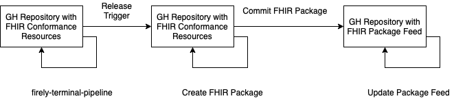

# fhir-package-registry-pipeline

GitHub Action Pipeline for version management of FHIR conformance resource using a [FHIR package](https://registry.fhir.org/learn), including:
  * create a FHIR package
  * commit the package itself to a Git repo for safekeeping
  * update the a FHIR package registry feed 

The current pipeline allows to manage a FHIR package feed fully in GitHub, no external hosting needed.

1. Develop your FHIR conformance resources on GitHub. Execution of FHIR Shorthand and validation of generated artefacts can be achieved using [Firely Terminal Pipeline](https://github.com/FirelyTeam/firely-terminal-pipeline/).
2. The created package needs to be publicly accessible to be indexed by the [FHIR Package Registry](https://registry.fhir.org). The package generated by this pipeline can therefore be commited to a public Git repo.
3. The [FHIR package feed](https://registry.fhir.org/submit) will be updated automatically based on the information provided by the package.json of the generated package.

## Options

You can specify the following options using the ["with" syntax](https://docs.github.com/en/actions/reference/workflow-syntax-for-github-actions#jobsjob_idstepswith) in your GitHub Actions yml configuration:

* SIMPLIFIER_USERNAME:
   - description: 'Simplifier email address (not username), needed for running Quality Control checks. Please use GitHub Secrets for this variable.'
   - required: true
* SIMPLIFIER_PASSWORD:
   - description: 'Simplifier password, needed for running Quality Control checks. Please use GitHub Secrets for this variable.'
   - required: true
